#### Here are the logical tricky and output based questions

**Code step by step - Karishma**

***Guess the output for Code - 01***
```
function details(){
  console.log("name:", name);
  console.log("occupation:", occupation);
  
  var name = "Karishma";
  let occupation = "SDE"
}

console.log("details:", details());
```
***output***
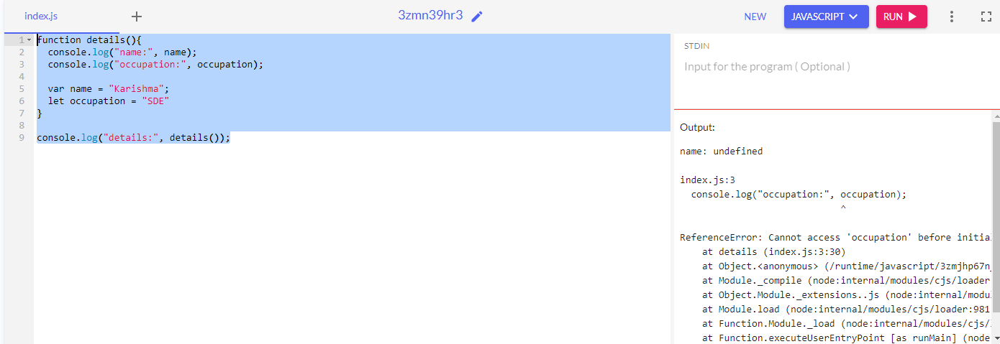

***Explanation***
- Here Javascript hoisting rule is applied
- ***Hoisting - It is  a mechnaism in js, where variable and function declaration are move to the top of their scope, before the code execution***
- Whenever we are declaring any variable in hoisting, it allows us to use that variable before declaring. Here we are using the variable , then declaring it 
- Hoisting rule is applied on var, but not applied on let and const variables, 
- so, ***let occupation = "SDE"***, will show refernce error
- While ***var name = "Karishma";***, will show undefined becuase of variable hoisting rule, which says, "for each variable( variable declaration ) a property is created in the varible object, which is then set to "undefined"
 
____________________________________________________________________________________________________

***Guess the output for Code - 02***

```
for(var i=0; i<3; i++){
  setTimeout(()=> console.log("i:", i), 1);
}
```
***output***
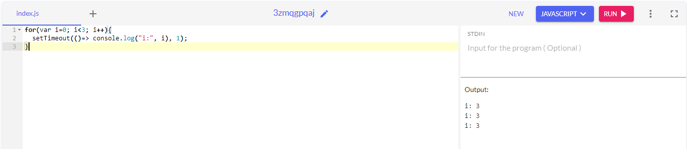

***Explanation***
- Here the concept of closures is used
- Here literal i is declared using var, Here i has global scope, As setTimeout will take some time to provide the oputput and before loop is finished of setTimeout
- So here basically 'i' value in global scope is basically 3 , and after that setTimeout will basically do console.log("i:", i) -> 3 times , and at that time ***'i'***
has value ***'3'*** in the global scope, that's why it will set its value 3 there, for all the cases

***Closures***
- Closures in action, inner function have access to outer function variables and global variables

- **A closure is the combination ofa function and the lexical enviornmnet within which the function was declared.**
____________________________________________________________________________________________________

***Guess the output for Code - 03***

```
for(let i=0; i<3; i++){
  setTimeout(()=> console.log("i:", i), 1);
}
```
***output***
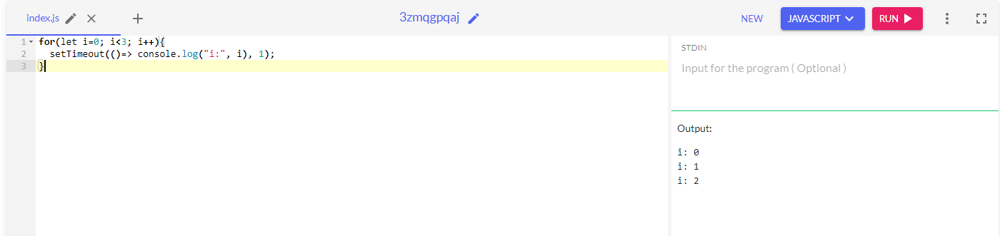

***Explanation***
- Here the concept of closures is used
- Here literal **i is declared using let, Here i doesn't has global scope, it has only block scope, It will only run in this particular block, so for every setTimeout it has a different value, ***var***  has global scope that's why it has the same value, as mentioned in abv example**

***Closures***
- Closures in action, inner function have access to outer function variables and global variables

- **A closure is the combination ofa function and the lexical enviornmnet within which the function was declared.**
____________________________________________________________________________________________________

***Guess the output for Code - 04***

```
console.warn("+true :", +true);
console.warn("typeof +true :", typeof +true);
```
***output***
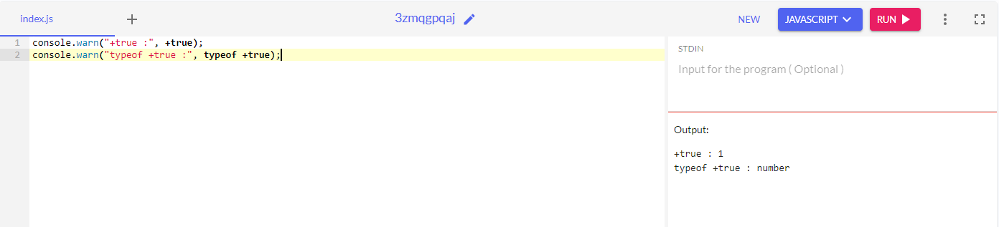

***Explanation***
- Here the **console.warn("+true :", +true);** is 1, beacuse if we are using + sign before any boolean value and string value, it will conver it into the number value and the value of true is 1, so it will console 1
- Here the **console.warn("+true :", +true);** is number, beacuse the type of 1 is number, so it will console number.

____________________________________________________________________________________________________

***Guess the output for Code - 05***

```
console.warn("!Karishma :", !"Karishma");
console.warn("!!Karishma :", !!"Karishma");
console.warn(`typeof ("Karishma"):`, typeof ("Karishma"));
```
***output***
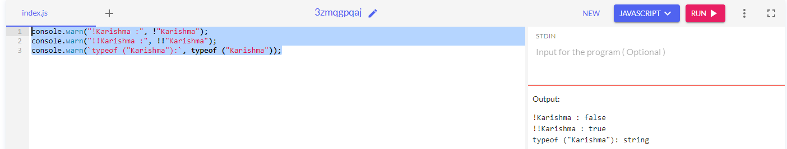

***Explanation***
- Here the **console.warn("!Karishma :", !"Karishma");** is **false**, beacuse negation of string false, and for 2nd negation of false is true so the ouput of second console will be **true**.

____________________________________________________________________________________________________

***Guess the output for Code - 06***

```
let data = "size";
const bird = {
    size: "small"
};
console.warn(bird[data]);
console.warn(bird["size"]);
console.warn(bird.size);
console.warn(bird.data);
```
***output***
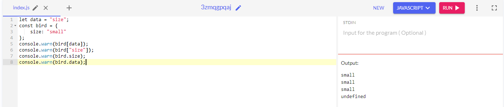

***Explanation***
- Here the **console.warn(bird[data]);** is **small**, beacuse whenever we have any object and we want to pass any key as a variable or any dynamic key, then we can use square brackets as we have used here.
- Here the **console.warn(bird["size"]);** is **small**, beacuse whenever we have any object and we want to pass any key as a variable or any dynamic key or any string value, then we can use square brackets as we have used here.
- Here the **console.warn(bird.size);** is **small**
- Here the **console.warn(bird.data);** is **undefined**, as we cannot access the object name dot any variable name, then this is not going to work
____________________________________________________________________________________________________

***Guess the output for Code - 07***

```
let c = { name:"anny"};
let d;
d=c;
c.name="bob";
console.log(d.name);
console.log(c.name);

```
***output***
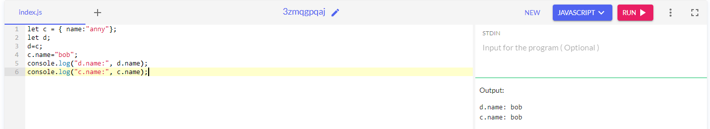

***Explanation***
- Here the **console.log(d.name);** and **console.log(c.name);** is **"bob"**, beacuse of shallow copy whenever we are using object it will basically use the refernce type that is stored on one place and if change in one variable c then it will automatically change in variable d because both has the same memory refernce.
____________________________________________________________________________________________________

***Guess the output for Code - 08***

```
var x;
var x = 10;
console.log('x:', x);
```
***output***
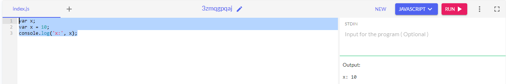

***Explanation***
- Here the **console.log('x:', x);** is **"x: 10"**, here we have declared variable x then reclared it, we have declared the same variable 2 times, with var redeclaration is possible.

let's take the same example with let keyword
```
let y;
let y = 5;
console.log('y:', y);
```

***output***
- Here is throow - **Uncaught SyntaxError: Identifier 'y' has already been declared**
- Redeclaration with let is not possible.
____________________________________________________________________________________________________
***Guess the output for Code - 09***
```
var x;
let x = 10;
console.log('x:', x);
```
***output***
- Here is throow - **Uncaught SyntaxError: Identifier 'x' has already been declared**
- Redeclaration with let is not possible.

```
let y;
var y = 5;
console.log('y:', y);
```
***output***
- Here is throow - **Uncaught SyntaxError: Identifier 'y' has already been declared**
- Redeclaration with let is not possible.
____________________________________________________________________________________________________
***Guess the output for Code - 10***
```
let a = 3;
let b = new Number(3);
console.log("a==b:", a==b);
console.log("a===b:", a===b);

//output
// a==b: true
// a===b: false
```
***Explanation***
- Here ***console.log("a==b:", a==b);*** is "true",  while ***console.log("a===b:", a===b);*** is false, becuse datatype of a and b are different although there value is the same 
- console.log("typeof a:", typeof a); --> **typeof a: number**
- console.log("typeof b:", typeof b); --> **typeof b: object**

- whenever we are using "new" or "new keyword" with the number class, that time it will always give an object
- when we are matching the value , there value is same , but the type is different.

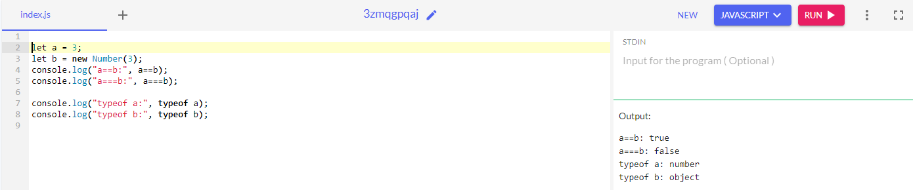

```
let a = 3;
let b = a;
console.log("a==b:", a==b);
console.log("a===b:", a===b);

//output
// a==b: true
// a===b: true
```
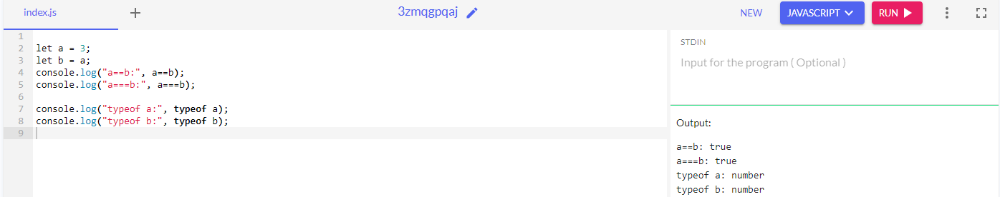

**Overall output**
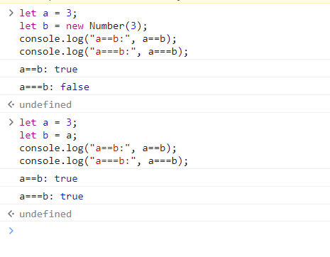

